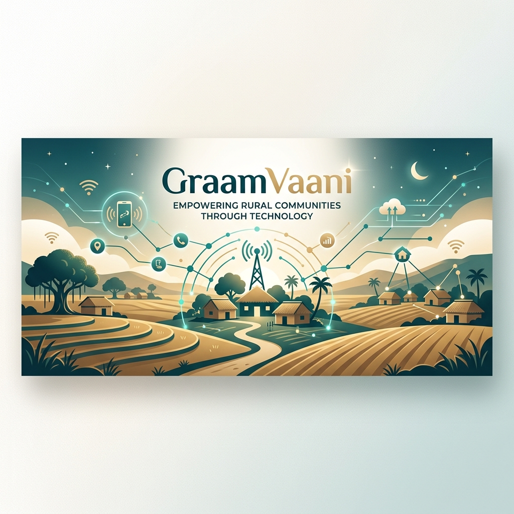

# 🎙️ GraamVaani



> **"The news radio in your pocket — no internet, no smartphone, no literacy required."**

GraamVaani is a revolutionary IVR-based news and information platform designed for rural communities. It bridges the digital divide by delivering AI-generated audio bulletins through a simple phone call, empowering users who may not have access to smartphones or the internet.

---

## ✨ Key Features

- **📻 IVR-First Experience**: Users receive daily news bulletins by simply dialing a dedicated number.
- **🎙️ AI Audio Generation**: Automated pipeline that converts text news into natural-sounding audio using advanced TTS.
- **🌾 Regional Support**: Content tailored specifically for rural needs, including farming advice, local news, and panchayat updates.
- **📊 Analytics Dashboard**: A premium administrative portal for monitoring call logs, user registrations, and bulletin performance.
- **🏘️ Panchayat Integration**: Dedicated registration flows for both individual farmers and village administrative bodies (Panchayats).

---

## 🛠️ Tech Stack

### Frontend (Management Portal)
- **Framework**: [Vite](https://vitejs.dev/) + [React](https://reactjs.org/)
- **Icons**: [Lucide React](https://lucide.dev/)
- **Charts**: [Recharts](https://recharts.org/)
- **Styling**: Vanilla CSS (Premium, Glassmorphic UI)

### Backend (API & IVR Engine)
- **Runtime**: [Node.js](https://nodejs.org/) + [Express](https://expressjs.com/)
- **Database**: [Firebase Firestore](https://firebase.google.com/docs/firestore)
- **IVR Integration**: [Exotel](https://exotel.com/) & [Twilio](https://www.twilio.com/)
- **Scheduling**: [Node-Cron](https://www.npmjs.com/package/node-cron) for automated bulletin updates.

---

## 🚀 Getting Started

### Prerequisites
- **Node.js**: v18 or later.
- **Firebase Project**: A service account key (`firebase-key.json`) in the `backend/` directory.

### Quick Start (Full-Stack)
From the root directory, run:

```bash
# Install dependencies for both frontend and backend
npm run install:all

# Launch both servers concurrently
npm run dev
```

*   **Frontend**: http://localhost:5173
*   **Backend**: http://localhost:5000

---

## ⚙️ Environment Configuration

### Backend (`/backend/.env`)
Create a `.env` file in the backend folder with the following variables:
- `PORT`: (Default: 5000)
- `FIREBASE_SERVICE_ACCOUNT_PATH`: Path to your Firebase service account JSON.
- `TWILIO_ACCOUNT_SID`: (Optional) For Twilio-based IVR.
- `TWILIO_AUTH_TOKEN`: (Optional)
- `TWILIO_PHONE_NUMBER`: (Optional)

### Frontend (`/frontend/.env`)
- `VITE_API_BASE_URL`: URL of the running backend (e.g., `http://localhost:5000/api`)

---

## 📂 Project Structure

```text
.
├── backend/               # Node.js Express API
│   ├── models/            # Firestore model abstractions
│   ├── services/          # TTS and Logic services
│   ├── env.example        # Reference for environment variables
│   └── index.js           # Server entry point
├── frontend/              # Vite + React Portal
│   ├── src/               # Application source code
│   │   ├── components/    # Reusable UI components
│   │   ├── pages/         # Dashboard, Landing, Analytics
│   │   └── utils/         # API helpers
│   └── public/            # Static assets
└── banner.png             # Project Banner
```

---

## 🌐 Deployment

The project is optimized for deployment on **Vercel** or any cloud provider supporting Node.js and static site hosting.

- The root `vercel.json` handles the multi-package deployment.
- Ensure all Firebase and Exotel credentials are set as environment variables in your deployment dashboard.

---

<div align="center">
  <sub>Built with ❤️ for rural connectivity.</sub>
</div>
